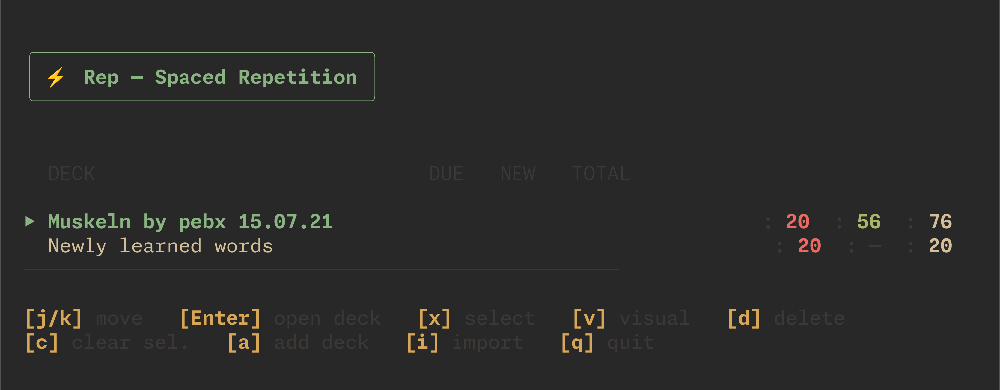

# rep

> **🚧 In Development:** This project is actively being developed. Some features are still missing or experimental.



> **Built with AI-assisted development as a personal tool for spaced repetition learning.**

A spaced repetition flashcard app that lives in your terminal. Think **Anki**, but as a CLI — built with [Ink](https://github.com/vadimdemedes/ink) and React.


---


## Features

### 📚 Deck Management
- Create, browse, and delete decks from a dashboard
- Import decks from Anki `.apkg` files
- View deck stats at a glance — due count, new cards, total

### 🃏 Card Management
- Add flashcards with front/back text
- Browse all cards in a deck with vim-style navigation (`j`/`k`)
- Edit and delete cards (supports multi-select with `x` and visual mode `v`)

### 🧠 Spaced Repetition (SM-2)
Cards progress through a state machine inspired by Anki:

```
new → learning → review
                   ↑       │
                   │    (fail)
                   │       ↓
                   └── relearning
```

- **New** — never seen before
- **Learning** — recently introduced, short intervals (1 min → 10 min)
- **Review** — graduated, intervals in days/weeks
- **Relearning** — failed a review, cycles back through learning steps

Rating a card:

| Button | Effect |
|--------|--------|
| `[1] Again` | Reset to step 0 (learning/relearning) |
| `[2] Hard` | Stay at current step |
| `[3] Good` | Advance to next step; graduate if past the last step |
| `[4] Easy` | Graduate immediately |

### 🔁 Session Loop
- A review session **does not end** until every card has been learned
- Failed cards are sent to the back of the queue and reappear later
- Rating buttons show interval hints (e.g. `1m`, `10m`, `1d`)
- Live progress counter shows remaining and completed cards

### 🎯 Configurable Card Cap
- Before each session, you're prompted: *"How many cards would you like to review?"*
- Default is **20** — just press Enter to accept
- The cap applies to the mix of due review cards + new cards

---

## Installation

### Prerequisites
- [Node.js](https://nodejs.org/) v18 or higher
- npm (comes with Node.js)

### From source

```bash
# Clone the repo
git clone https://github.com/mcdrew07/rep.git
cd rep

# Install dependencies
npm install

# Build
npm run build

# Run
npm start
```

### Install globally (optional)

```bash
# Link the CLI so you can run `rep` from anywhere
npm link
```

Then just run:

```bash
rep
```

---

## Usage

### Keyboard Shortcuts

**Dashboard**

| Key | Action |
|-----|--------|
| `j` / `k` | Navigate decks |
| `Enter` | Open deck |
| `x` | Select deck |
| `v` | Visual select mode |
| `d` | Delete selected |
| `a` | Add new deck |
| `i` | Import `.apkg` file |
| `q` | Quit |

**Review Session**

| Key | Action |
|-----|--------|
| `Space` / `Enter` | Reveal answer |
| `1` | Again |
| `2` | Hard |
| `3` | Good |
| `4` | Easy |
| `q` / `Esc` | End session early |

### Importing Anki Decks

1. Export a deck from Anki as `.apkg`
2. Run `rep`, press `i` from the dashboard
3. Enter the path to your `.apkg` file

---

## Tech Stack

| Layer | Technology |
|-------|------------|
| UI | [Ink](https://github.com/vadimdemedes/ink) + React |
| Language | TypeScript |
| Database | SQLite via [better-sqlite3](https://github.com/WiseLibs/better-sqlite3) |
| Algorithm | SM-2 (SuperMemo 2) with state machine |
| Import | Anki `.apkg` (ZIP + SQLite) |

Data is stored at `~/.config/rep/data.db`.

---

## 🚀 Planned / Unimplemented Features

- **Syncing to AnkiWeb**: Full synchronization with AnkiWeb to keep decks updated across all your devices.
- **Media Support**: Handling embedded images or audio assets inside cards.
- **Advanced Card Types**: Support for cloze deletions, reverse cards, and other complex card layouts.
- **Tagging System**: Organize, search, and filter cards efficiently using tags.
- **Custom Scheduling Algorithms**: Options to configure or tweak spaced repetition algorithm parameters (like FSRS).

---

## Development

```bash
# Run in dev mode (no build step)
npm run dev

# Type-check without emitting
npx tsc --noEmit

# Build for production
npm run build
```

---

## License

ISC
